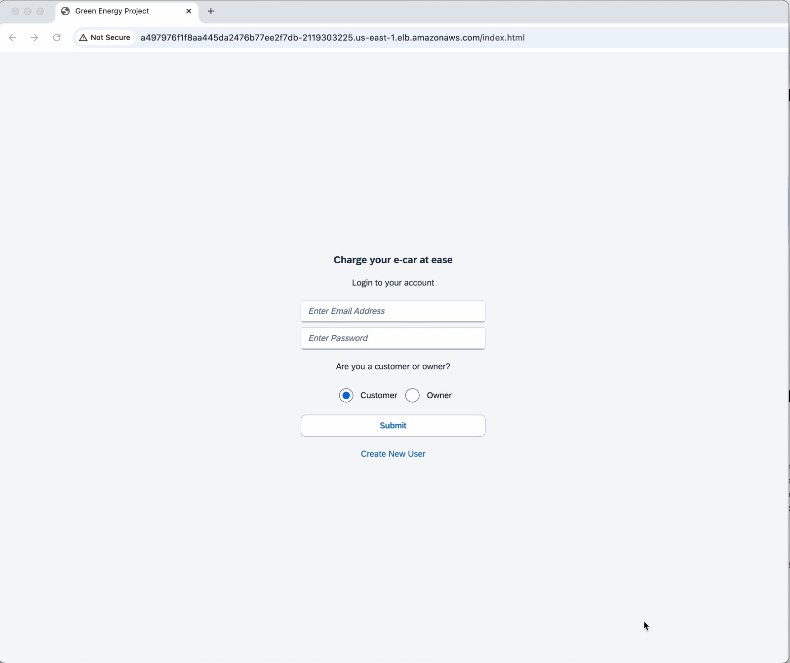
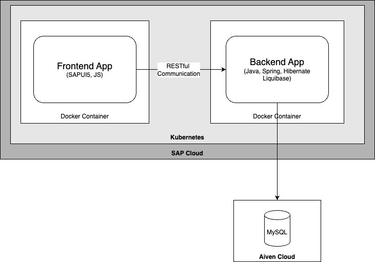

## Watch the Demo Video

Click the image above to watch the demo video on YouTube.
 

## Architecture

## Description

## Backend Techstack 
Java, Spring/Spring Boot, Liquibase, Hybernate, Maven

## Frontend Techstack
Nodejs, SAP Open UI5, Typescript

## Database
MySQL, MySQL Workbench

## DevOps/Deployment Techstack
Docker, Docker Hub, Kubernetes, SAP Kyma Runtime

## API Testing
PostMan

## Architecture

## How to run backend?

## How to run frontend?

## Github commands

## Docker commands

## Kubernetes commands

## Backend API

eval "$(/opt/homebrew/bin/brew shellenv)"

https://cockpit.hanatrial.ondemand.com/trial/#/globalaccount/94028c6a-c7c7-48ee-9860-ef74fb782a0d/subaccount/e4d9e46b-27b6-47f7-853b-cc355b83533f/subaccountoverview

docker build -t echarger-app . --platform linux/amd64
docker build -t echarger-frontend-app . --platform linux/amd64

docker tag echarger-app:latest znashitah/hfu-repo:echarger-app
docker tag echarger-frontend-app:latest znashitah/hfu-repo:echarger-frontend-app

docker push znashitah/hfu-repo:echarger-app
docker push znashitah/hfu-repo:echarger-front-app
docker images
docker run -p 8081:8081 echarger-frontend-app

kubectl apply -f echarger-app-deployment.yaml
kubectl apply -f echarger-frontend-app-deployment.yaml

export KUBECONFIG=/Users/nashitahzainab/Downloads/kubeconfig--garden-kyma--c-0fe43cc-external.yaml

kubectl create secret docker-registry dockerhub-secret --docker-server=https://index.docker.io/v1/   --docker-username=znashitah   --docker-password=<Password>  --docker-email=znashitah@gmail.com